# Function Graph

This file maps the current face recognition API. The runtime graph shows how requests move through the hybrid full-face, landmark-aligned region, and optional occlusion-model pipeline, followed by a function/class inventory.

## Runtime Graph

```mermaid
flowchart TD
    Client["API client"] --> App["main.app: FastAPI"]
    App --> Cors["CORSMiddleware"]
    App --> StatsMw["StatsMiddleware.dispatch"]
    App --> Router["app.api.routes.router"]
    App --> Health["health_check"]

    StatsMw --> TrackerRecord["RequestTracker.record_request"]
    StatsMw --> RouteHandler["Route handler"]

    Router --> Decode["decode_base64_image"]
    Router --> ViewFace["view_face_image"]
    Router --> Register["register_face"]
    Router --> Recognize["recognize_face"]
    Router --> Delete["delete_face"]
    Router --> AdminStats["get_system_stats"]

    Register --> ValidateRegister["Validate name, phone, file types"]
    ValidateRegister --> IsRegistered["VectorDBService.is_user_registered"]
    Register --> PrimaryDetails["FaceRecognitionService.analyze_primary_face_details"]
    PrimaryDetails --> AnalyzeAll["FaceRecognitionService.analyze_all_faces"]
    AnalyzeAll --> LoadModel["FaceRecognitionService._load_model"]
    AnalyzeAll --> DecodeImage["FaceRecognitionService._decode_image"]
    AnalyzeAll --> Fallbacks["FaceRecognitionService._detect_faces_with_fallbacks"]
    Fallbacks --> Variants["FaceRecognitionService._image_variants"]
    Fallbacks --> BuildResult["FaceRecognitionService._build_result"]
    BuildResult --> Align["FaceRecognitionService._aligned_face_crop"]
    BuildResult --> RegionCrops["FaceRecognitionService._region_crops"]
    BuildResult --> RegionDescriptors["FaceRecognitionService._region_descriptor"]
    BuildResult --> Quality["FaceRecognitionService._quality_metrics"]
    BuildResult --> OcclusionEmbedding["FaceRecognitionService._occlusion_embedding"]
    OcclusionEmbedding --> LoadOcclusion["FaceRecognitionService._load_occlusion_model"]
    BuildResult --> Visible["FaceRecognitionService._visible_regions"]
    Register --> RegisterUser["VectorDBService.register_user"]

    Recognize --> AnalyzeAll
    Recognize --> StagedSearch["VectorDBService.staged_search_face"]
    StagedSearch --> FullStage["VectorDBService._search_full_face"]
    StagedSearch --> RegionStage["VectorDBService._search_region_face"]
    StagedSearch --> OcclusionStage["VectorDBService._search_occlusion_face"]
    StagedSearch --> MergeStages["VectorDBService._merge_stage_results"]
    StagedSearch --> ConfidenceReason["VectorDBService._confidence_reason"]
    FullStage --> AddScores["VectorDBService._add_scores"]
    RegionStage --> AddScores
    OcclusionStage --> AddScores
    AddScores --> Rank["VectorDBService._rank_groups"]
    StagedSearch --> EnsureCollection["VectorDBService._ensure_collection_exists"]

    ViewFace --> QdrantRetrieve["QdrantClient.retrieve"]
    Delete --> IsRegistered
    Delete --> DeleteByMetadata["VectorDBService.delete_face_by_metadata"]
    AdminStats --> GetCollectionInfo["VectorDBService.get_collection_info"]
    AdminStats --> TrackerStats["RequestTracker.get_stats"]

    RegisterUser --> EnsureCollection
    IsRegistered --> EnsureCollection
    DeleteByMetadata --> EnsureCollection
    GetCollectionInfo --> EnsureCollection

    EnsureCollection --> Qdrant["Qdrant collection faces-4.0"]
```

## API Entrypoints

| Symbol | File | What it does |
| --- | --- | --- |
| `health_check()` | `face_recognition_app/main.py` | Returns `{"status": "ok"}` for `/health`. |
| `_match_quality(score, quality)` | `face_recognition_app/app/api/routes.py` | Converts fused score and occlusion score into `high`, `medium`, or `low` match quality. |
| `decode_base64_image(request)` | `face_recognition_app/app/api/routes.py` | Strips any data URL prefix, decodes a base64 image, and returns JPEG bytes. |
| `view_face_image(face_id)` | `face_recognition_app/app/api/routes.py` | Retrieves a Qdrant payload by ID and returns stored `face_image` bytes when image payload storage is enabled. |
| `register_face(front_image, left_image, right_image, name, age)` | `face_recognition_app/app/api/routes.py` | Registers a user from three profile images, extracting full embeddings, aligned regional descriptors, optional occlusion embeddings, model-used flags, and quality metadata; stores face image payload only when configured. |
| `recognize_face(file)` | `face_recognition_app/app/api/routes.py` | Detects faces, runs staged full/region/occlusion recognition, and returns enriched detections with confidence reasons. |
| `delete_face(name)` | `face_recognition_app/app/api/routes.py` | Deletes registered face records matching the supplied name. |
| `get_system_stats(request)` | `face_recognition_app/app/api/routes.py` | Reports process memory, Qdrant collection stats, and per-path request stats. |
| `get_system_stats(request)` | `face_recognition_app/app/api/admin_routes_snippet.py` | Older unused/admin snippet version of the stats route. |

## Face Recognition Service

| Symbol | File | What it does |
| --- | --- | --- |
| `FaceAnalysisResult` | `face_recognition_app/app/services/face_recognition.py` | Dataclass carrying one detected face: full embedding, aligned crop, bbox, confidence, region descriptors, visible regions, quality, optional occlusion embedding, occlusion-model flag, and fallback used. |
| `FaceRecognitionService.__init__()` | `face_recognition_app/app/services/face_recognition.py` | Stores model configuration and defers InsightFace/occlusion model creation until first use. |
| `FaceRecognitionService._load_model()` | `face_recognition_app/app/services/face_recognition.py` | Lazily creates and prepares `FaceAnalysis` with the configured CPU-only ONNX provider while suppressing known third-party model-load chatter. |
| `FaceRecognitionService._insightface_log_context()` | `face_recognition_app/app/services/face_recognition.py` | Suppresses InsightFace model inventory prints and the known `face_align` deprecation warning when configured. |
| `FaceRecognitionService._load_occlusion_model()` | `face_recognition_app/app/services/face_recognition.py` | Lazily loads an optional ONNX model from `OCCLUSION_MODEL_PATH`. |
| `FaceRecognitionService._decode_image(image_bytes)` | `face_recognition_app/app/services/face_recognition.py` | Converts image bytes into an OpenCV BGR image via OpenCV first, then Pillow/HEIF fallback. |
| `FaceRecognitionService._image_variants(img)` | `face_recognition_app/app/services/face_recognition.py` | Yields original, upscaled, contrast-enhanced, sharpened, and rotated images for robust detection retries. |
| `FaceRecognitionService._rotate_image(img, angle)` | `face_recognition_app/app/services/face_recognition.py` | Rotates an image while preserving canvas size and filling borders. |
| `FaceRecognitionService._detect_faces_with_fallbacks(img)` | `face_recognition_app/app/services/face_recognition.py` | Runs InsightFace detection across image variants and returns the first successful variant. |
| `FaceRecognitionService._encode_crop(crop)` | `face_recognition_app/app/services/face_recognition.py` | Encodes a crop as base64 JPEG. |
| `FaceRecognitionService._crop_face(img, bbox)` | `face_recognition_app/app/services/face_recognition.py` | Crops a padded face region within image bounds. |
| `FaceRecognitionService._region_crops(face_crop)` | `face_recognition_app/app/services/face_recognition.py` | Splits an aligned face crop into upper, lower, left, right, and center regions. |
| `FaceRecognitionService._aligned_face_crop(img, face)` | `face_recognition_app/app/services/face_recognition.py` | Uses eye landmarks to rotate, scale, and crop a normalized face image; falls back to bbox crop when landmarks are unavailable. |
| `FaceRecognitionService._region_descriptor(crop)` | `face_recognition_app/app/services/face_recognition.py` | Builds a normalized 128-dimensional grayscale descriptor for a region. |
| `FaceRecognitionService._quality_metrics(crop, face)` | `face_recognition_app/app/services/face_recognition.py` | Calculates blur, brightness, contrast, occlusion score, and landmark presence. |
| `FaceRecognitionService._occlusion_embedding(aligned_crop)` | `face_recognition_app/app/services/face_recognition.py` | Runs optional ONNX occlusion-aware embedding inference, normalizes output, and pads/trims to configured size. |
| `FaceRecognitionService._visible_regions(region_crops)` | `face_recognition_app/app/services/face_recognition.py` | Marks regions visible when contrast and dark/bright ratios are acceptable. |
| `FaceRecognitionService._build_result(face, img, fallback_used)` | `face_recognition_app/app/services/face_recognition.py` | Converts an InsightFace detection into a full `FaceAnalysisResult`. |
| `FaceRecognitionService.analyze_face(image_bytes)` | `face_recognition_app/app/services/face_recognition.py` | Compatibility helper returning `(embedding, face_image)` for the largest detected face. |
| `FaceRecognitionService.analyze_primary_face_details(image_bytes)` | `face_recognition_app/app/services/face_recognition.py` | Returns the largest detected face as a `FaceAnalysisResult`. |
| `FaceRecognitionService.analyze_all_faces(image_bytes)` | `face_recognition_app/app/services/face_recognition.py` | Decodes an image, runs fallback detection, sorts faces by size, and returns `FaceAnalysisResult` objects. |

## Vector Database Service

| Symbol | File | What it does |
| --- | --- | --- |
| `VectorDBService.__init__()` | `face_recognition_app/app/services/vector_db.py` | Creates a Qdrant client and tracks collection initialization. |
| `VectorDBService._ensure_collection_exists()` | `face_recognition_app/app/services/vector_db.py` | Lazily creates `faces-4.0` with three 512D full-face vectors, 15 regional 128D vectors, and three occlusion vectors. |
| `VectorDBService.register_user(front_vec, left_vec, right_vec, region_vectors, occlusion_vectors, metadata)` | `face_recognition_app/app/services/vector_db.py` | Stores one user point with full profile vectors, regional vectors, optional occlusion vectors, and metadata payload. |
| `VectorDBService._add_scores(groups, results, channel, weight)` | `face_recognition_app/app/services/vector_db.py` | Adds weighted channel scores into per-person fusion groups. |
| `VectorDBService._rank_groups(groups, limit)` | `face_recognition_app/app/services/vector_db.py` | Converts accumulated channel score groups into sorted result dictionaries while preserving best-channel evidence. |
| `VectorDBService._channel_display_score(group)` | `face_recognition_app/app/services/vector_db.py` | Computes a stage score from the best channel score, conservative channel average, and small channel-agreement bonus. |
| `VectorDBService._search_full_face(vector, limit)` | `face_recognition_app/app/services/vector_db.py` | Searches the query full-face embedding against front, left profile, and right profile vectors. |
| `VectorDBService._search_region_face(region_vectors, visible_regions, limit)` | `face_recognition_app/app/services/vector_db.py` | Searches visible regional descriptors against all stored profile-region channels. |
| `VectorDBService._search_occlusion_face(occlusion_vector, limit)` | `face_recognition_app/app/services/vector_db.py` | Searches optional occlusion-aware embedding against stored occlusion channels. |
| `VectorDBService._merge_stage_results(stages, limit)` | `face_recognition_app/app/services/vector_db.py` | Merges full, region, and occlusion stages, preserving the strongest supported score while also returning conservative `fused_score`. |
| `VectorDBService._display_score(group)` | `face_recognition_app/app/services/vector_db.py` | Computes the public score from the best stage score, weighted fused score, and small multi-stage agreement bonus. |
| `VectorDBService._confidence_reason(final_results, stages, quality)` | `face_recognition_app/app/services/vector_db.py` | Generates a human-readable reason for confidence or ambiguity. |
| `VectorDBService.staged_search_face(vector, region_vectors, visible_regions, occlusion_vector, occlusion_model_used, quality, limit)` | `face_recognition_app/app/services/vector_db.py` | Runs full-face search first, conditionally adds region search, and adds occlusion search only when a real occlusion model produced the query vector. |
| `VectorDBService.search_face(vector, region_vectors, visible_regions, limit)` | `face_recognition_app/app/services/vector_db.py` | Backward-compatible wrapper around staged search. |
| `VectorDBService.is_user_registered(name)` | `face_recognition_app/app/services/vector_db.py` | Counts Qdrant points matching `name`. |
| `VectorDBService.delete_face_by_metadata(name)` | `face_recognition_app/app/services/vector_db.py` | Deletes all Qdrant points matching `name`. |
| `VectorDBService.get_collection_info()` | `face_recognition_app/app/services/vector_db.py` | Returns Qdrant collection metadata after ensuring the collection exists. |

## Middleware, Schemas, And Tests

| Symbol | File | What it does |
| --- | --- | --- |
| `RequestTracker.__new__(cls)` | `face_recognition_app/app/middleware/stats.py` | Implements singleton request counters and process start timestamp. |
| `RequestTracker.record_request(path)` | `face_recognition_app/app/middleware/stats.py` | Increments the request count for a path. |
| `RequestTracker.get_stats()` | `face_recognition_app/app/middleware/stats.py` | Calculates total requests and requests per minute for each tracked path. |
| `StatsMiddleware.dispatch(request, call_next)` | `face_recognition_app/app/middleware/stats.py` | Records `/api/v1` requests and forwards the request. |
| `Settings` | `face_recognition_app/app/core/config.py` | Holds app settings, CPU-only InsightFace provider settings, InsightFace log suppression, Qdrant settings, vector sizes, collection name, and optional occlusion-model settings. |
| `FaceRegisterResponse` | `face_recognition_app/app/schemas/face.py` | Registration response containing ID, message, and profile face crops. |
| `FaceMetadata` | `face_recognition_app/app/schemas/face.py` | Metadata shape for registered face details. |
| `FaceMatch` | `face_recognition_app/app/schemas/face.py` | Recognition match including public score, fused score, stage scores, metadata, stored image, match quality, breakdown, recognition stages, and confidence reason. |
| `FaceDetection` | `face_recognition_app/app/schemas/face.py` | Result group for one query face, including crop, visible regions, quality, fallback, occlusion-model flag, and message. |
| `FaceSearchResponse` | `face_recognition_app/app/schemas/face.py` | Top-level recognition response containing detections and optional message. |
| `MessageResponse` | `face_recognition_app/app/schemas/face.py` | Simple message response used by delete operations. |
| `Base64Request` | `face_recognition_app/app/schemas/face.py` | Request body containing one `base64_string`. |
| `tests/conftest.py` | `face_recognition_app/tests/conftest.py` | Adds the app root to `sys.path` for stable test imports. |
| `tests/test_api.py` | `face_recognition_app/tests/test_api.py` | Tests registration, staged recognition response, no-face response, delete, and stats behavior with mocked services. |
| `tests/test_recognition.py` | `face_recognition_app/tests/test_recognition.py` | Tests image decoding and landmark-aligned crop behavior. |
| `tests/test_vector_db.py` | `face_recognition_app/tests/test_vector_db.py` | Tests staged search branching for strong and weak/occluded candidates. |
